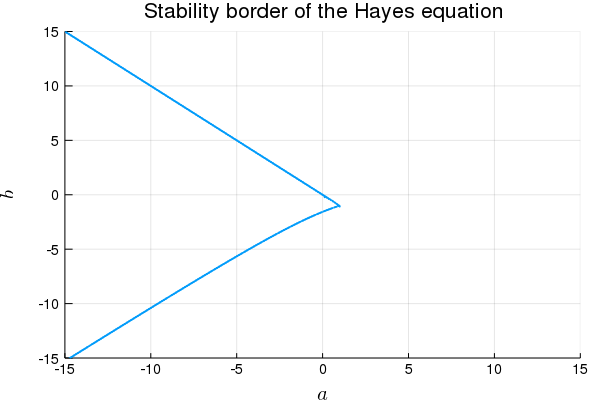
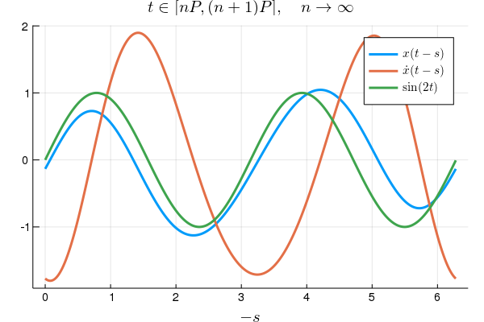
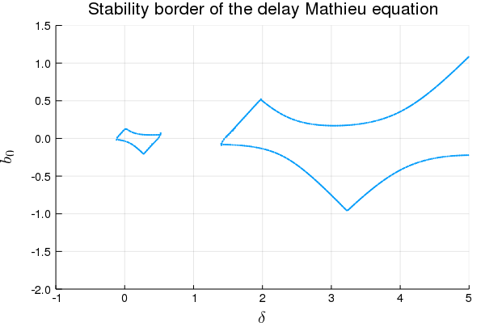

# SemiDiscretizationMethod.jl

Julia package to investigate the behaviour of linear delay differential equations based on the book 
[Semi-Discretization for Time-Delay Systems (by Insperger and Stepan)](http://link.springer.com/10.1007/978-1-4614-0335-7) 
and the **Multiplication-Free Semi-Discretization** method.

This package provides a tool to approximate the stability properties and stationary behaviour of linear periodic delay systems of the form:

$$ \dot{\mathbf{x}}(t) = \mathbf{A}(t) \mathbf{x}(t) + \sum_{j=1}^g \mathbf{B}_j(t) \mathbf{x}(t-\tau_j(t))+\mathbf{c}(t)$$

## Multiplication-Free Semi-Discretization (MFSD)

The traditional Semi-Discretization method transforms the DDE into a mapping $\mathbf{y}_{n+1} = \mathbf{F}_n\mathbf{y}_n+\mathbf{f}_n$, which requires the multiplication of many sub-matrices, resulting in quadratic time complexity. 

The **Multiplication-Free Semi-Discretization** method (implemented as `DiscreteMapping_LR`) represents the one-period mapping as a large sparse system:
$$\mathbf{\Phi}_L \mathbf{y}_{n+1} = \mathbf{\Phi}_R \mathbf{y}_n + \mathbf{v}_n$$

where $\mathbf{y}_n$ is the discretized state space vector:
$$ \mathbf{y}_n = \left(\mathbf{x}(t_n)^\top, \mathbf{x}(t_{n-1})^\top,\ldots,\mathbf{x}(t_{n-r})\right)^\top\!.$$

This approach provides the **exact same results** as the traditional method but reduces the computational complexity to **linear**, making it significantly faster for high-resolution discretizations.

### Stability and Stationary Solution
Traditionally, the Monodromy matrix (or One-Period mapping) $\mathbf{\Phi}_n$ is determined by the product of the one-step mapping matrices:
$$\mathbf{\Phi}_n =\prod_{i=0}^{p-1}\mathbf{F}_{n+i}$$

The stability of the original system can be investigated by the spectral radius $\rho$ of $\mathbf{\Phi}_n$:
$$\rho\left(\mathbf{\Phi}_n\right): \quad
    \begin{matrix}
    <1 & \Rightarrow & \text{stable}\\
    >1 & \Rightarrow & \text{unstable}
    \end{matrix}
    $$

In the **Multiplication-Free** approach, the stability is determined by the spectral radius $\rho$ of the generalized eigenvalue problem:
$$\det(\rho \mathbf{\Phi}_L - \mathbf{\Phi}_R) = 0$$

The stationary solution (periodic orbit) is obtained by solving the fixed-point equation:
$$(\mathbf{\Phi}_L - \mathbf{\Phi}_R) \mathbf{y}^* = \mathbf{v}$$

# Citing

If you use this package, please cite both the foundational book and the Multiplication-Free method paper:

**Foundational Book:**
```bibtex
@book{Insperger2011,
  author = {Insperger, Tam{\'{a}}s and St{\'{e}}p{\'{a}}n, G{\'{a}}bor},
  title = {{Semi-Discretization for Time-Delay Systems}},
  publisher = {Springer New York},
  year = {2011},
  doi = {10.1007/978-1-4614-0335-7}
}
```

**Multiplication-Free Method:**
```bibtex
@article{Bachrathy2026,
  author = {Daniel Bachrathy},
  title = {{Multiplication-Free Semi-Discretization Method for Time-Periodic Delayed Systems}},
  journal = {Journal of Vibration and Control},
  year = {2026},
  note = {In Press}
}
```

# Usage with examples
## Installation
```julia
julia> ] add SemiDiscretizationMethod
```

## Hayes equations
$$\dot{x}(t) = a \,x(t) + b \,x(t-1) + 1.$$

```julia
using SemiDiscretizationMethod

function createHayesProblem(a,b)
    AMx =  ProportionalMX(a*ones(1,1));
    τ1 = t -> 1.0; 
    BMx1 = DelayMX(τ1,b*ones(1,1));
    cVec = Additive(ones(1))
    LDDEProblem(AMx,[BMx1],cVec)
end

hayes_lddep = createHayesProblem(-1.0, -1.0)
method = SemiDiscretization(1, 0.1)
τmax = 1.0
mapping = DiscreteMapping_LR(hayes_lddep, method, τmax, calculate_additive=true)

@show spectralRadiusOfMapping(mapping)
@show fixPointOfMapping(mapping)
```

### Stability borders of the Hayes Equation
```julia
using MDBM

using Plots
gr();
using LaTeXStrings

method=SemiDiscretization(4,0.1);
τmax=1.

foo(a,b) = log(spectralRadiusOfMapping(DiscreteMapping_LR(createHayesProblem(a,b),method,τmax,
    n_steps=1))); # No additive term calculated

axis=[Axis(-15.0:15.,:a),
    Axis(-15.0:15.,:b)]

iteration=3;
stab_border_points=getinterpolatedsolution(solve!(MDBM_Problem(foo,axis),iteration));

scatter(stab_border_points...,xlim=(-15.,15.),ylim=(-15.,15.),
    label="",title="Stability border of the Hayes equation",xlabel=L"a",ylabel=L"b",
    guidefontsize=14,tickfont = font(10),markersize=2,markerstrokewidth=0)
```


## Delay Mathieu equation
$$\ddot{x}(t) + a_1 \dot{x}(t)+(\delta + \varepsilon \cos(t))x(t) = b_0 x(t-2\pi) + \sin(2t)$$

```julia
function createMathieuProblem(δ, ε, b0, a1; T=2π)
    AMx = ProportionalMX(t -> @SMatrix [0.0 1.0; -δ-ε*cos(2π / T * t) -a1])
    τ1 = t -> 2π
    BMx1 = DelayMX(τ1, t -> @SMatrix [0.0 0.0; b0 0.0])
    cVec = Additive(t -> @SVector [0.0, sin(4π / T * t)])
    LDDEProblem(AMx, [BMx1], cVec)
end

τmax = 2π
T = 2π
mathieu_lddep = createMathieuProblem(3.0, 2.0, -0.15, 0.1, T=T)
method = SemiDiscretization(1, 0.01)

mapping = DiscreteMapping_LR(mathieu_lddep, method, τmax, calculate_additive=true)

# Get smooth periodic solution with the new interface
sol_periodic = get_periodic_solution(mapping, mathieu_lddep, method)

using Plots
plot(sol_periodic, vars=1, title="Stationary Orbit")

# Alternative: plot the raw fixPointOfMapping
fp = fixPointOfMapping(mapping)
using LaTeXStrings
n_steps = Int((T+100eps(T))÷method.Δt)
t_plot = 0.0:method.Δt:((size(fp,1)/2-1)*method.Δt)
plot(t_plot,fp[1:2:end],
    xlabel=L"-s",title=L"t \in [nT,(n+1)T],\quad n \to \infty",guidefontsize=14,linewidth=3,
    label=L"x(t-s)",legendfontsize=11,tickfont = font(10))
plot!(t_plot,fp[2:2:end],
    xlabel=L"-s",linewidth=3,
    label=L"\dot{x}(t-s)")
plot!(t_plot,sin.(2 .* t_plot),linewidth=3,label=L"\sin(2t)")
```


### Stability Chart of the delayed Mathieu equation
```julia
using MDBM
a1=0.1;
ε=1;
τmax=2π;
T=1π;
method=SemiDiscretization(2,T/40);

foo(δ,b0) = log(spectralRadiusOfMapping(DiscreteMapping_LR(createMathieuProblem(δ,ε,b0,a1,T=T),method,τmax,
    n_steps=Int((T+100eps(T))÷method.Δt)))); # No additive term calculated
using MDBM
axis=[Axis(-1:0.2:5.,:δ),
    Axis(-2:0.2:1.5,:b0)]
    
iteration=3;
stab_border_points=getinterpolatedsolution(solve!(MDBM_Problem(foo,axis),iteration));

scatter(stab_border_points...,xlim=(-1.,5),ylim=(-2.,1.5),
    label="",title="Stability border of the delay Mathieu equation",xlabel=L"\delta",ylabel=L"b_0",
    guidefontsize=14,tickfont = font(10),markersize=2,markerstrokewidth=0)
```


If you are interested in the behaviour of your linear delay model in the presence of Gaussian white noise, please consider the [StochasticSemiDiscretizationMethod.jl](https://github.com/HTSykora/StochasticSemiDiscretizationMethod.jl) package.
